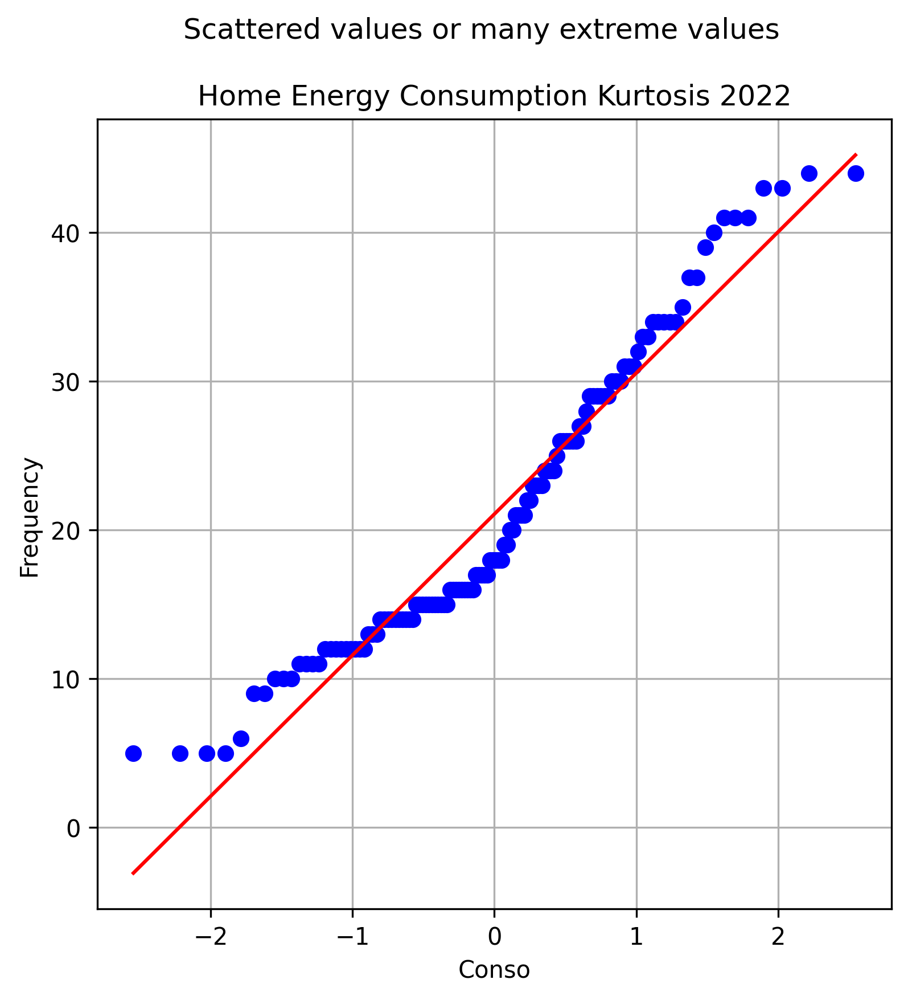

**[Index](index.md)**

|   Year |   Conso Total |
|-------:|--------------:|
|   2022 |          2656 |
|   2023 |          7556 |
|   2024 |         10080 |
|   2025 |          6599 |

- **ANNEE** : 2022
- **Nombres de valeurs (Conso kW par jour)** : 126
- **mode (Conso la plus frequente)** : 15
- **nombre mode** : 1
- **mean (Conso Moyenne)** : 21.08
- **median (Conso Mediane)** : 18.0
- **Conso Min** : 5
- **Conso Max** : 44
- **Variance sample** : 92.86
- **Variance population (Valeurs dispersees autour de la moyenne)** : 92.12
- **Ecart Type sample** : 9.64
- **Ecart Type population (les valeurs s’ecartent d’environ x unités de la moyenne)** : 9.6
- **Coeff de variation** : 45.71
- **Skewness (symetrie d’une distribution autour de sa moyenne)** : 0.63
- **Kurtosis** : -0.42
- **GINI (dispersion ou inegalite - 0 a 1)** : 0.25

##############################################

- **ANNEE** : 2023
- **Nombres de valeurs (Conso kW par jour)** : 365
- **mode (Conso la plus frequente)** : 15
- **nombre mode** : 1
- **mean (Conso Moyenne)** : 20.7
- **median (Conso Mediane)** : 19.0
- **Conso Min** : 4
- **Conso Max** : 60
- **Variance sample** : 105.28
- **Variance population (Valeurs dispersees autour de la moyenne)** : 104.99
- **Ecart Type sample** : 10.26
- **Ecart Type population (les valeurs s’ecartent d’environ x unités de la moyenne)** : 10.25
- **Coeff de variation** : 49.56
- **Skewness (symetrie d’une distribution autour de sa moyenne)** : 0.59
- **Kurtosis** : -0.0
- **GINI (dispersion ou inegalite - 0 a 1)** : 0.28

##############################################

- **ANNEE** : 2024
- **Nombres de valeurs (Conso kW par jour)** : 366
- **mode (Conso la plus frequente)** : 16
- **nombre mode** : 1
- **mean (Conso Moyenne)** : 27.54
- **median (Conso Mediane)** : 22.0
- **Conso Min** : 5
- **Conso Max** : 84
- **Variance sample** : 286.87
- **Variance population (Valeurs dispersees autour de la moyenne)** : 286.08
- **Ecart Type sample** : 16.94
- **Ecart Type population (les valeurs s’ecartent d’environ x unités de la moyenne)** : 16.91
- **Coeff de variation** : 61.5
- **Skewness (symetrie d’une distribution autour de sa moyenne)** : 1.21
- **Kurtosis** : 0.85
- **GINI (dispersion ou inegalite - 0 a 1)** : 0.33

##############################################

- **ANNEE** : 2025
- **Nombres de valeurs (Conso kW par jour)** : 238
- **mode (Conso la plus frequente)** : 17
- **nombre mode** : 2
- **mean (Conso Moyenne)** : 27.73
- **median (Conso Mediane)** : 26.0
- **Conso Min** : 2
- **Conso Max** : 86
- **Variance sample** : 246.16
- **Variance population (Valeurs dispersees autour de la moyenne)** : 245.12
- **Ecart Type sample** : 15.69
- **Ecart Type population (les valeurs s’ecartent d’environ x unités de la moyenne)** : 15.66
- **Coeff de variation** : 56.59
- **Skewness (symetrie d’une distribution autour de sa moyenne)** : 0.59
- **Kurtosis** : 0.15
- **GINI (dispersion ou inegalite - 0 a 1)** : 0.32

##############################################

